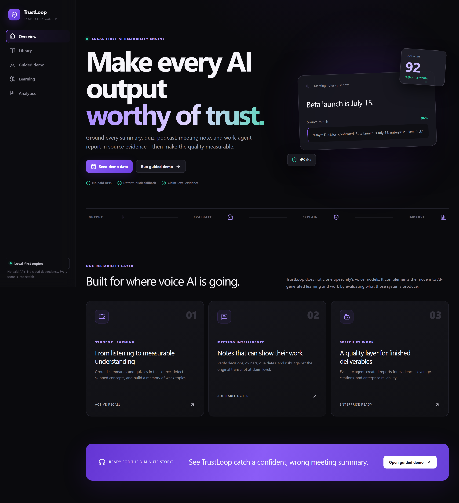
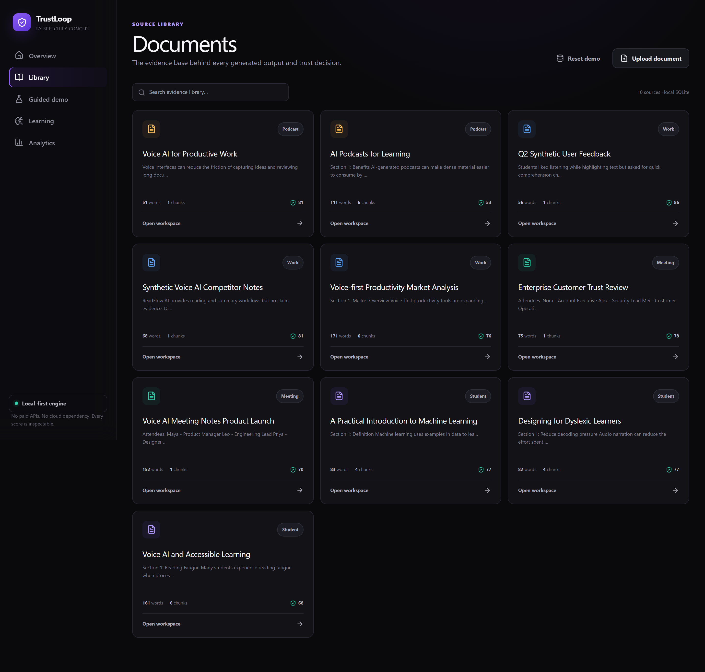
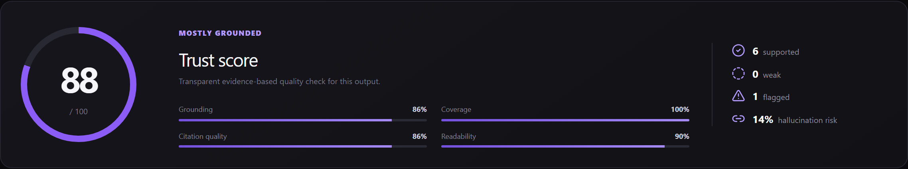
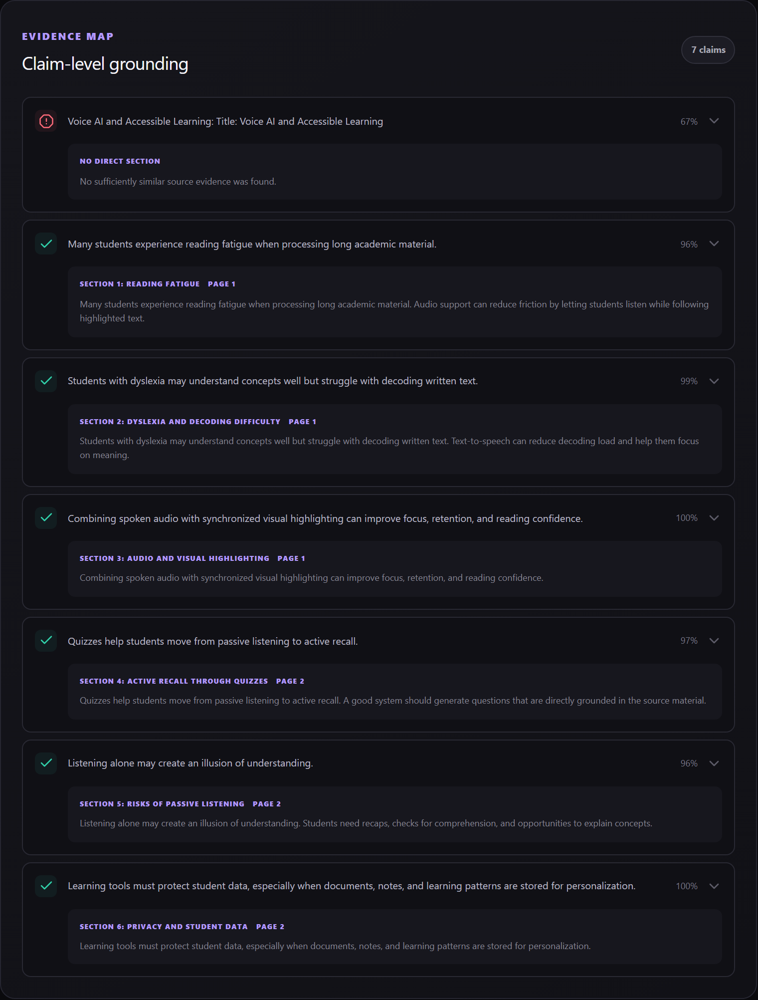
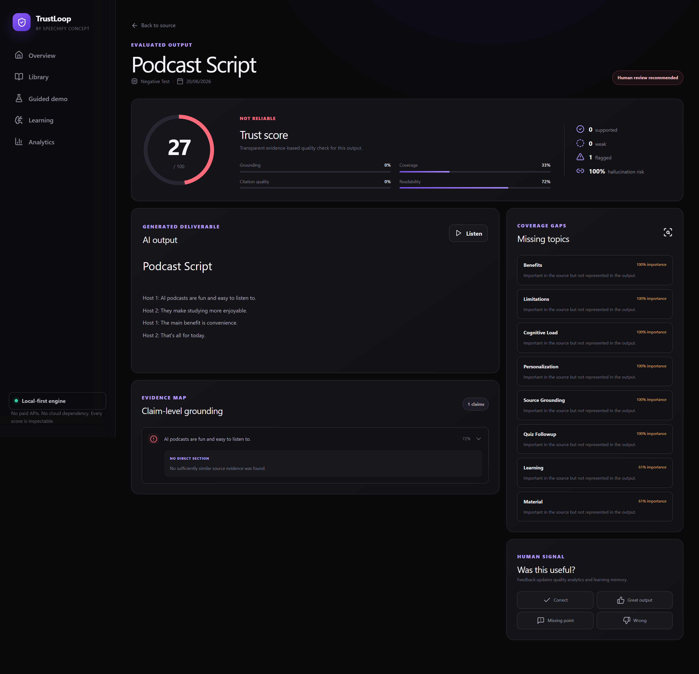
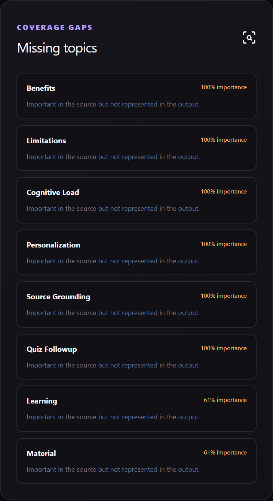
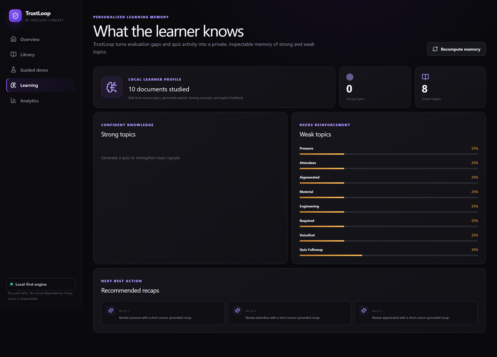
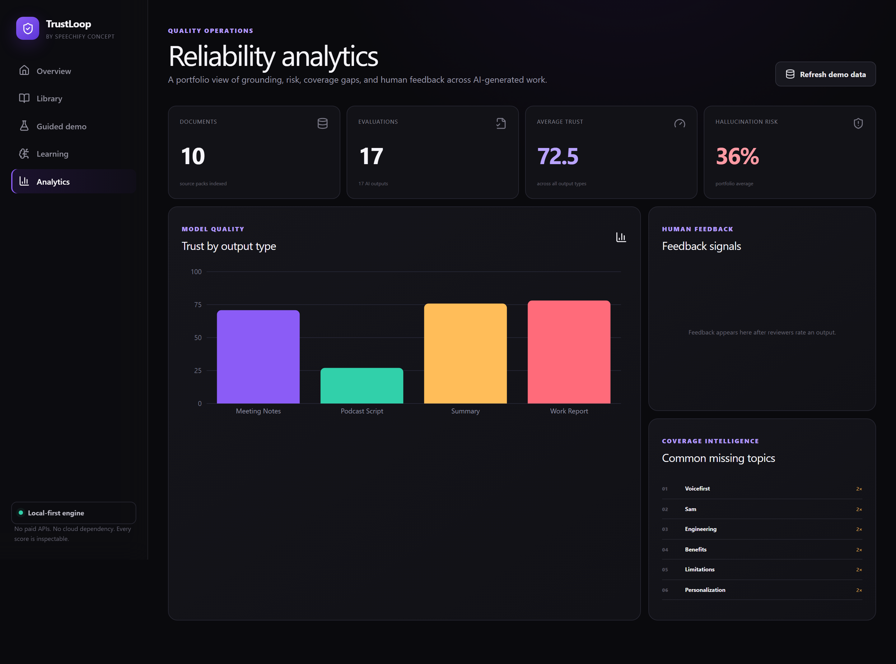

# Speechify TrustLoop

## Overview

Speechify TrustLoop is a zero-budget, local-first reliability engine for AI-generated summaries, quizzes, podcast scripts, meeting notes, document answers, and work reports.

It answers the question that appears after generation: **Can I trust this output, and can it show me why?**

TrustLoop breaks an output into claims, retrieves relevant source chunks, classifies support, detects missing topics, calculates transparent quality metrics, and learns from human feedback.

> This project does not clone Speechify's voice models. It complements Speechify's voice-first AI direction by adding reliability, grounding, evaluation, feedback, and analytics.

## Why This Matters

Voice-first AI makes information easier to consume and work easier to produce. That convenience also makes confident omissions and hallucinations harder to notice. Consumer learners need comprehension checks; professionals need traceable meeting notes; enterprise teams need citations, auditability, privacy, and human review signals.

TrustLoop makes those requirements visible and measurable.

## How It Connects to Speechify

The prototype supports a clear product story:

- Speechify learning outputs become grounded summaries and source-relevant quizzes.
- AI podcasts expose coverage gaps and retain links to source evidence.
- Meeting notes make decisions, owners, dates, and risks auditable.
- Speechify Work-style reports gain an enterprise quality and feedback layer.

## Features

- Synthetic demo document seeding and TXT, MD, PDF, or DOCX upload
- Deterministic local generation for summaries, key points, quizzes, podcasts, meeting notes, work reports, and document Q&A
- Claim-level evidence retrieval with supported, weak, unsupported, and contradicted states
- Grounding, coverage, citation, readability, hallucination-risk, and task-fit metrics
- Missing-topic detection
- Human feedback capture
- Personalized learning memory with strong topics, weak topics, and recap recommendations
- Portfolio analytics by output type
- Browser speech synthesis for output preview
- Three guided one-click demo flows
- Deliberately incorrect negative tests that demonstrate TrustLoop catching failures

## Architecture

```text
Next.js UI
   |
FastAPI routes
   |
   +-- document parser -> section-aware chunks -> SQLite
   +-- deterministic output generator
   +-- claim splitter -> lexical retrieval -> contradiction heuristics
   +-- topic coverage -> transparent scoring
   +-- feedback -> learning memory -> analytics
```

The core path has no network requirement and downloads no model. A small hashed embedding utility and lexical retrieval make startup immediate and deterministic.

See [docs/architecture.md](docs/architecture.md).

## Zero-Budget Stack

- Next.js, TypeScript, Tailwind CSS, Recharts
- FastAPI, SQLAlchemy, SQLite, Pydantic
- PyMuPDF and python-docx for local file parsing
- Browser SpeechSynthesis API
- Pytest

No OpenAI, Speechify, ElevenLabs, or other paid API is required.

## Demo Flows

1. **Student learning:** generate a grounded summary or quiz, inspect missing concepts, then view the learner's weak-topic memory.
2. **Meeting notes:** generate decisions and action items, inspect evidence, then open the incorrect seeded notes to see wrong dates, owners, and requirements flagged.
3. **Speechify Work:** generate a strategic market report, inspect claim evidence, and open the portfolio analytics dashboard.

The full talk track is in [docs/demo-script.md](docs/demo-script.md).

## Trust Score Methodology

The score is intentionally transparent:

```text
35% grounding
25% source-topic coverage
15% citation/evidence availability
10% readability and structure
10% human feedback prior
 5% task-specific quality
```

Unsupported and contradicted claims separately increase hallucination risk. The score prioritizes human review; it is not a claim of mathematical certainty.

See [docs/trust-score-methodology.md](docs/trust-score-methodology.md).

## Data Model

SQLite stores:

- users
- documents and document chunks
- AI outputs
- evaluation runs
- claim checks and source evidence
- missing topics
- user feedback
- learning memory
- analytics events

## API Routes

Key routes:

- `GET /health`
- `POST /api/demo/seed`
- `GET /api/documents`
- `POST /api/documents/upload`
- `POST /api/generate/{output-type}`
- `POST /api/ask`
- `POST /api/evaluate/{output_id}`
- `GET /api/outputs/{output_id}/trust-card`
- `GET /api/outputs/{output_id}/claims`
- `GET /api/outputs/{output_id}/missing-topics`
- `POST /api/feedback`
- `GET /api/learning-memory/{user_id}`
- `GET /api/analytics/overview`

FastAPI exposes the full interactive schema at `http://localhost:8000/docs`.

## Local Setup

### 1. Backend

```bash
cd backend
python -m venv .venv
.venv\Scripts\activate
pip install -r requirements.txt
uvicorn app.main:app --reload
```

### 2. Frontend

In another terminal:

```bash
cd frontend
npm install
npm run dev
```

Open `http://localhost:3000`, click **Seed demo data**, and choose **Guided demo**.

Environment defaults are documented in `.env.example`. Docker Compose is included as an optional convenience.

## Testing

```bash
cd backend
pytest

cd ../frontend
npm run build
```

Tests cover health, seeding, uploads, chunking, generation, supported and unsupported evaluation, contradiction detection, missing topics, feedback, learning memory, and analytics.

### Verification status

- Backend tests: 15 passed
- Frontend production build: passed
- Dependency audit: 0 vulnerabilities
- Live backend/frontend smoke test: passed (good summary trust 88.4, negative test trust 27.0)

## Screenshots

Captured from a live local run with seeded demo data (see [docs/screenshots/](docs/screenshots/)).

| Landing | Document library |
| --- | --- |
|  |  |

| High-trust Trust Card (88) | Claim-level evidence |
| --- | --- |
|  |  |

| Low-trust negative test (27) | Missing-topics coverage gaps |
| --- | --- |
|  |  |

| Learning memory | Reliability analytics |
| --- | --- |
|  |  |

## Future Roadmap

1. Real-time voice input evaluation
2. Browser extension for evaluating web summaries
3. Enterprise audit export
4. Team-level quality dashboards
5. Personalized daily audio recap generation
6. Deeper contradiction detection
7. Model comparison dashboard
8. Human review workflow
9. Integrations with calendar, docs, and meeting tools
10. Privacy-first on-device evaluation mode

## Resume Positioning

> Built Speechify TrustLoop, a zero-budget AI reliability engine that evaluates summaries, quizzes, AI podcast scripts, meeting notes, and agent-generated reports for source grounding, coverage, hallucination risk, citation quality, missing topics, and user feedback using FastAPI, SQLite, retrieval, Next.js, and analytics dashboards.

